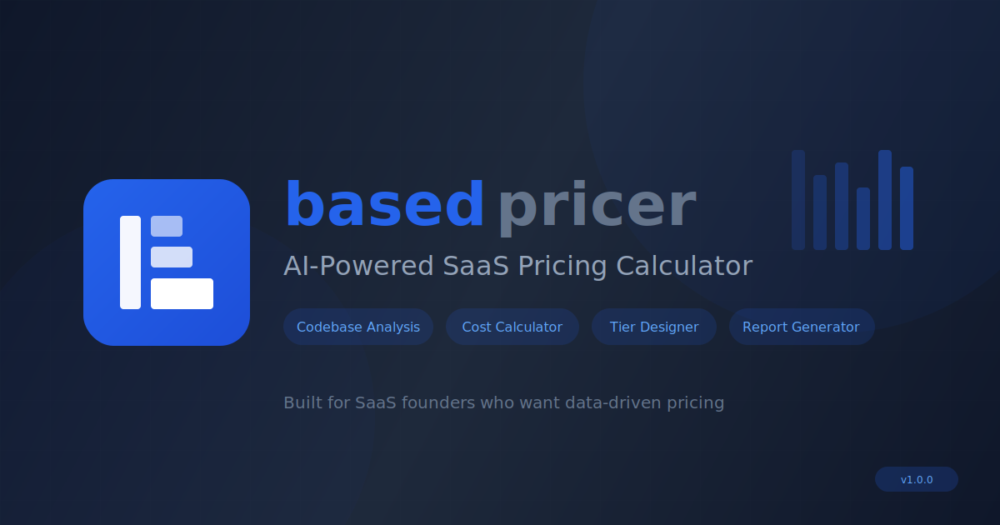

<div align="center">



<br />
<br />

[](https://react.dev)
[](https://typescriptlang.org)
[](https://tailwindcss.com)
[](LICENSE)

**AI-powered SaaS pricing calculator for founders**

[Demo](https://basedpricer.com) · [Report Bug](https://github.com/hazlijohar95/BasedPricer/issues) · [Request Feature](https://github.com/hazlijohar95/BasedPricer/issues)

</div>

---

## Quick Start

```bash
git clone https://github.com/hazlijohar95/BasedPricer.git && cd BasedPricer && npm i && npm run dev
```

Open **[localhost:5173](http://localhost:5173)**

---

## What It Does

| | Feature | What You Get |
|:---:|---------|--------------|
| 🔍 | **GitHub Import** | Connect your repo → AI discovers features & cost drivers |
| 📊 | **Cost Calculator** | Variable + fixed costs → margin analysis |
| 🎛️ | **Pricing Tiers** | Set up what each plan includes and costs |
| 🎨 | **Pricing Preview** | See your pricing page before you build it |
| 📝 | **Report Generator** | Export for accountants, investors, engineers |

---

## AI Providers

Works with any provider. Bring your own API key.

| Provider | Models | Best For |
|----------|--------|----------|
| **OpenAI** | GPT-4o, o1 | Balanced cost/quality |
| **Anthropic** | Claude 4, 3.5 | Nuanced analysis |
| **OpenRouter** | 100+ models | Model variety |
| **MiniMax** | M2.1 (1M ctx) | Large codebases |
| **Custom** | Any OpenAI-compatible | Self-hosted |

> 🔒 Keys stored locally in browser. Never sent to our servers.

---

## Project Structure

```
src/
├── components/        # UI components
├── context/           # Global state (PricingContext)
├── hooks/             # Custom hooks
├── services/          # AI client, GitHub API
└── utils/             # Calculations, formatters

public/config/         # Editable JSON configs
├── ai-providers.json  # Provider pricing data
└── analysis-prompts.json
```

---

## Configuration

All data is JSON — no code changes needed.

<details>
<summary><strong>Update AI pricing</strong></summary>

Edit `public/config/ai-providers.json`:

```json
{
  "gpt-4o": {
    "inputPricePerMillion": 2.50,
    "outputPricePerMillion": 10.00,
    "lastPriceUpdate": "2026-01-19"
  }
}
```

</details>

<details>
<summary><strong>Add custom provider</strong></summary>

Through the UI, add any OpenAI-compatible endpoint:
- Self-hosted LLMs (Ollama, vLLM)
- Alternative providers (Groq, Together AI)
- Private endpoints

</details>

---

## Tech Stack

| Layer | Technology |
|-------|------------|
| Framework | React 19 + TypeScript 5.6 |
| Styling | Tailwind CSS 4.0 |
| State | React Context + custom hooks |
| Build | Vite 7 |
| Icons | Phosphor Icons |

---

## Contributing

```bash
# Fork & clone
git clone https://github.com/YOUR_USERNAME/BasedPricer.git

# Install & run
npm install && npm run dev

# Create branch
git checkout -b feature/your-feature
```

**Quick contributions:**
- Update AI pricing data
- Add new providers
- Improve business type detection
- Fix bugs

---

## License

MIT — see [LICENSE](LICENSE)

---

<div align="center">

**Built for SaaS founders** · [basedpricer.com](https://basedpricer.com)

</div>
